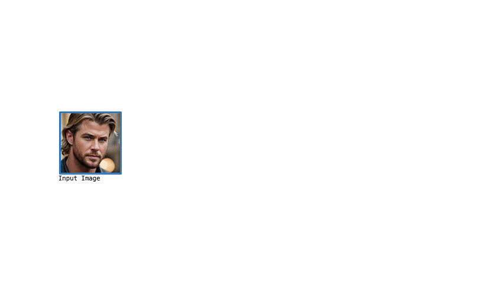

## Real-Time Deepfake Detection in the Real-World

Official Pytorch implementation of Real-Time Deepfake Detection in the Real-World paper.
<p align="center">
    🌐 <a href="https://vision.huji.ac.il/ladeda/" target="_blank">Project</a> | 📃 <a href="https://arxiv.org/abs/2406.09398" target="_blank">Paper</a><br>
</p>



> **Real-Time Deepfake Detection in the Real-World**<br>
> Bar Cavia, Eliahu Horwitz, Tal Reiss, Yedid Hoshen<br>
> <a href="https://arxiv.org/abs/2406.09398" target="_blank">https://arxiv.org/abs/2406.09398 <br>
>
>**Abstract:** Recent improvements in generative AI made synthesizing fake images
> easy; as they can be used to cause harm, it is crucial to develop accurate
> techniques to identify them. This paper introduces "Locally Aware Deepfake Detection Algorithm"
> (*LaDeDa*), that accepts a single 9x9 image patch and outputs its
> deepfake score. The image deepfake score is the pooled score of its patches.
> With merely patch-level information, LaDeDa significantly improves
> over the state-of-the-art, achieving around 99% mAP on current benchmarks.
> Owing to the patch-level structure of LaDeDa, we hypothesize that the generation
> artifacts can be detected by a simple model. We therefore distill LaDeDa
> into Tiny-LaDeDa, a highly efficient model consisting of only 4 convolutional layers.
> Remarkably, Tiny-LaDeDa has 375x fewer FLOPs and is 10,000x more 
> parameter-efficient than LaDeDa, allowing it to run efficiently on edge
> devices with a minor decrease in accuracy. These almost-perfect scores raise
> the question: is the task of deepfake detection close to being solved?
> Perhaps surprisingly, our investigation reveals that current training protocols
> prevent methods from generalizing to real-world deepfakes extracted from social
> media. To address this issue, we introduce *WildRF*, a new deepfake
> detection dataset curated from several popular social networks. 
> Our method achieves the top performance of 93.7% mAP on WildRF,
> however the large gap from perfect accuracy shows that
> reliable real-world deepfake detection is still unsolved.

## Setup
1. Clone this repository
```bash
git clone https://github.com/barcavia/RealTime-DeepfakeDetection-in-the-RealWorld
cd RealTime-DeepfakeDetection-in-the-RealWorld
```

2. Create a virtual environment, activate it and install the requirements file:
```
virtualenv -p /usr/bin/python3 venv
source venv/bin/activate
pip install -r requirements.txt
```
## Datasets
### WildRF
We propose to improve deepfake evaluation and align it with real-world settings by introducing *WildRF*,
a realistic benchmark consisting of images sourced from popular social platforms. 
Specifically, we *manually* collected real images and fake images using keywords and hashtags associated
with the suitable content. 
Our protocol is to train on one platform (e.g., Reddit) and test the detector
on real and fake images from other unseen platforms (e.g., Twitter and Facebook). 
- WildRF dataset can be downloaded [here](https://drive.google.com/file/d/1A0xoL44Yg68ixd-FuIJn2VC4vdZ6M2gn/view?usp=sharing).
- Download the file and unzip it in your path. This should create a directory structure as follows:
```
WildRF
└── train
.     ├── 0_real
.     ├── 1_fake 	
└── val
.     ├── 0_real
.     ├── 1_fake
└── test
      └── reddit
      .     ├── 0_real
      .     ├── 1_fake
      └── twitter
      .     ├── 0_real
      .     ├── 1_fake
      └── facebook
      .     ├── 0_real
      .     ├── 1_fake
```
- The '0_real' and '1_fake' directories contain real and fake images respectively. 
- ForenSynth and UFD datasets can be found in: [CNNDetection](https://github.com/peterwang512/CNNDetection), [UniversalFakeDetect](https://github.com/Yuheng-Li/UniversalFakeDetect). 

## Evaluation
- Once the dataset and the models weights have been downloaded, to evaluate LaDeDa and Tiny-LaDeDa run: 
```bash
python3 test.py --dataroot {PATH_TO_TEST_SET} --model_path {PATH_TO_CHECKPOINT.pth} --model {LaDeDa/Tiny} 
```
- Note that we provided a number of pretrained models in the weights directory.
Each model has two checkpoints: one trained on WildRF and one trained using the standard protocol (on ForenSynth).
To download LaDeDa's weights, use the following [link](https://drive.google.com/drive/folders/1KxNdnPRJJTuqxmzBPiGsg43tXzO8AN2d?usp=drive_link) and unzip it in weights/LaDeDa.
For Tiny_LaDeDa weights, use the weights in weights/Tiny_LaDeDa.
## Training
- LaDeDa can be trained with the following command:
```bash
python3 train.py --name LaDeDa --dataroot {PATH_TO_DATASET} --checkpoints_dir {./NAME_OF_CHECKPOINT} --batch_size 32 --lr 0.0002 --delr_freq 10   
```
if training LaDeDa on ForenSynth, you should also add the following arguments:
```bash
--classes airplane,bird,bicycle,boat,bottle,bus,car,cat,cow,chair,diningtable,dog,person,pottedplant,motorbike,tvmonitor,train,sheep,sofa,horse
--train_split train/progan --val_split test/progan   
```
- to train Tiny-LaDeDa, you should: 
1. obtain the distillation train set using LaDeDa's patch-level deepfake scores:
```bash
python3 extract_patches.py   
```
2. run the following command:
```bash
python3 train_Tiny_LaDeDa.py   
```

## Acknowledgment
Our training pipeline is similar to [NPR](https://github.com/peterwang512/CNNDetection), [UniversalFakeDetect](https://github.com/Yuheng-Li/UniversalFakeDetect) and [CNNDetection](https://github.com/peterwang512/CNNDetection).

## Citation
If you find this useful, please cite our paper:
